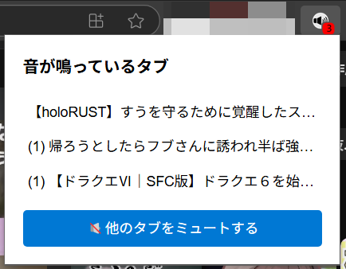
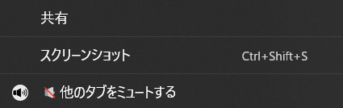

# Sound Tab Controller

A Microsoft Edge extension to control tab audio. View audible tabs across windows, switch to them, or mute all except the active tab.

## Features
- Lists audible tabs in a popup with Japanese/English support.
- Mutes other tabs with a button (auto-closes popup).
- Adds a context menu option to mute other tabs.
- Displays a badge with the number of audible tabs.

## Installation
1. Clone this repository: `git clone https://github.com/yourusername/sound-tab-switcher.git`
2. Load the extension in Edge (`edge://extensions/` → "Load unpacked").
3. Click the toolbar icon to open the popup.

## Screenshots

## License
MIT License